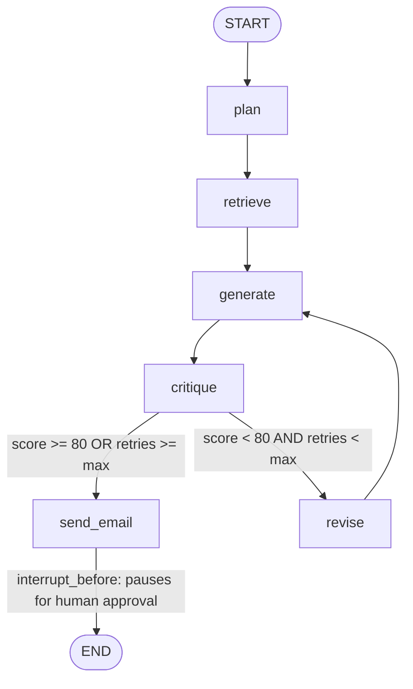

# Week 2 Day 3 — LangGraph: Stateful, Multi-Step & Cyclical Agent Workflows

A LangGraph workflow that recommends a budget laptop by planning, retrieving prices,
drafting a recommendation, critiquing its own draft, looping back to revise if the
critique score is too low, and pausing for human approval before "sending" the
recommendation email.

## Files

| File | What it is |
|---|---|
| `lang_graph_agent.ipynb` | Main notebook — all 5 tasks, with outputs |
| `products.json` | Small local "database" the `get_product_price` tool reads from (auto-created by the notebook on first run) |
| `requirements.txt` | Exact package versions used, for reproducing the environment |
| `.env` (not included — see below) | Holds `GEMINI_API_KEY`, required to run the notebook |

## Setup

1. Create and activate a virtual environment:
   ```
   python -m venv .venv
   .venv\Scripts\Activate.ps1
   ```
2. Install the exact dependencies:
   ```
   pip install -r requirements.txt
   ```
3. Create a `.env` file in this folder with:
   ```
   GEMINI_API_KEY=your_api_key_here
   ```
4. Open `lang_graph_agent.ipynb`, select this venv as the kernel, and run all cells top to bottom.

**Note on the model name:** Google periodically retires free-tier Gemini model names.
If `ChatGoogleGenerativeAI(model="...")` in the setup cell throws a 404 `NOT_FOUND`
error, the error message itself names the current replacement model — swap it in and
re-run.

## What each task covers

- **Task 1 — Graph Concepts & State Design:** explains `StateGraph`, nodes, edges,
  conditional edges, and the shared `State` object; defines the `RecommendationState`
  schema; draws the graph (ASCII + Mermaid) before any code.
- **Task 2 — Linear Graph:** `plan → retrieve → generate → critique` run as a straight
  line first, printing state after each node.
- **Task 3 — Conditional Edges & Cycles:** a `route_critique` conditional edge loops
  back to `generate` via `revise` when the critique score is below 80 (capped by
  `max_retries` to prevent infinite loops).
- **Task 4 — Human-in-the-Loop & Interrupts:** `interrupt_before=["send_email"]` pauses
  the graph before the "risky" action; both an approval path and a rejection path are
  demonstrated.
- **Task 5 — Persistence & Debugging:** `InMemorySaver` checkpointer persists state
  per `thread_id`; `get_state_history` + replaying from an earlier checkpoint
  demonstrate LangGraph's time-travel debugging.

## Graph diagram

```
        START
          |
          v
        plan
          |
          v
       retrieve
          |
          v
    +-> generate
    |     |
    |     v
    |  critique
    |     |
    |     v
    |  [route_critique]
    |   /            \
    |  / score<80 &    \ score>=80
    | / retries<max     \ or retries>=max
    | v                  v
    +revise          send_email   <-- interrupt_before pauses HERE for human approval
                          |
                          v
                         END
```



## `AgentExecutor`/`create_agent` vs. LangGraph

Use the agent APIs (Day 2) for a single, mostly-linear reasoning loop with tools.
Reach for LangGraph once the workflow needs explicit branching, a bounded
retry/self-correction loop, a mandatory human-approval pause, or persistence/replay
across sessions.

Author

Azka Ashfaq

AI and Data Science Intern
